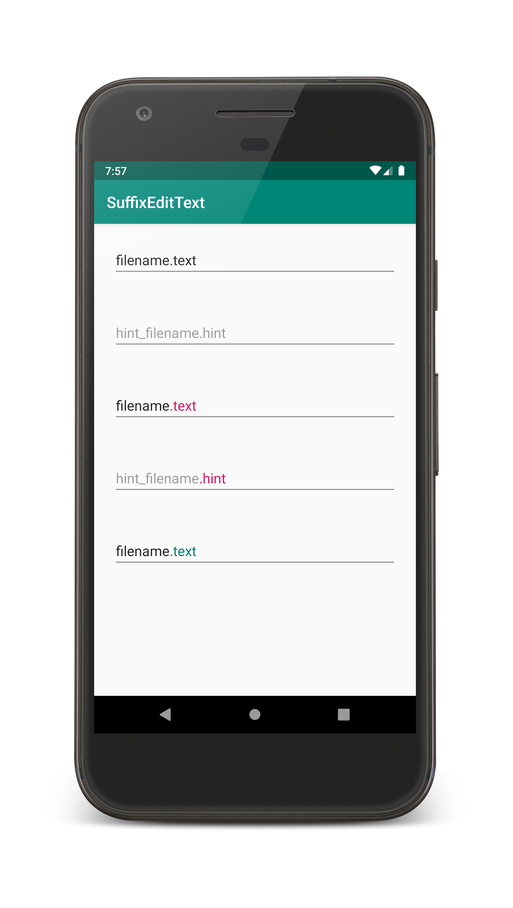

# SuffixEditText

[](https://android-arsenal.com/api?level=14)
[](https://travis-ci.com/ablomer/SuffixEditText)
[](https://jitpack.io/#ablomer/SuffixEditText)

Android EditText with suffix functionality



## Import

### Gradle

Add the JitPack repository to your root build.gradle file

```gradle
allprojects {
    repositories {
        // ...
        maven { url 'https://jitpack.io' }
    }
}
```

Add the dependency

```gradle
dependencies {
    implementation 'com.github.ablomer:SuffixEditText:1.1'
}
```

### Maven

Add the JitPack repository to your build file

```xml
<repositories>
    <repository>
        <id>jitpack.io</id>
        <url>https://jitpack.io</url>
    </repository>
</repositories>
```

Add the dependency

```xml
<dependency>
    <groupId>com.github.ablomer</groupId>
    <artifactId>SuffixEditText</artifactId>
    <version>1.1</version>
</dependency>
```

## Usage

```xml
<com.github.ablomer.suffixedittext.SuffixEditText
    ...
    app:suffix=".text"
    app:suffixColor="@color/colorPrimary"
    app:hintSuffix=".hint"
    app:hintSuffixColor="@color/colorAccent" />
```
